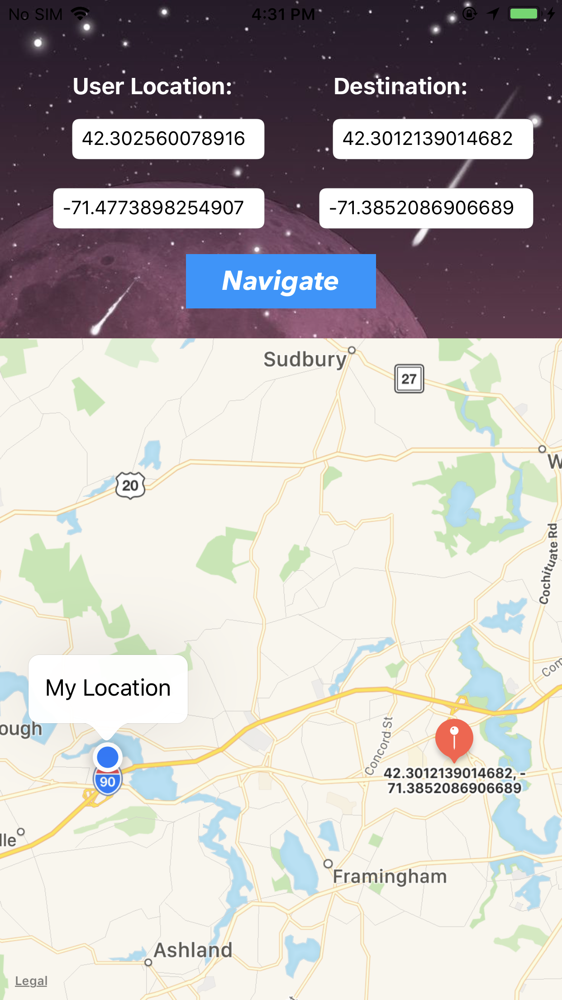

# Maps.nav (iOS Navigation App)

***This repository contains the code for an iOS navigation app made using Apple's Core-Location and MapKit API.***

# Description

This is a simple iOS app using Core-Location and MapKit provided by Apple to navigate a person from one place to other.

# Working

1. Run/Open the app


2. Allow the App to access your Location.


3. The app will automatically at startup zoom in to your current location. Also, it will show the Longitude and Latitude of user's current location.


4. On the map, zoom out a bit, scroll on the map and select your destination.


5. To set a pin for the destination, choose the destination and press there for 1 sec.



6. Once the pin appears at your destination, click on Navigate.


7. The app will show the best route depicted by the black line on the map.


8. Follow the black line and it will lead you to your destination.

***Here's a quick working demo of the App:***


# Requirements

* XCode 9
* Swift 3 and above
* iPhone 6 and above
* Toaster [for Toast Messages]

## Toaster Setup:
Go inside the project folder using terminal and type:

```
sudo gem install cocoapods
pod init
open -a Xcode Podfile
```
Edit the Podfile: Add the following line

```
pod 'Toaster'
```
and close the pod file.

To install and use 'Toaster' (for Toast Messages), use:
```
pod install
```

# Usage

1. Clone this repository using:
```
https://github.com/anujdutt9/Core-Location-Navigation.git
```

2. Go inside the folder and open the file in XCode:

```
AppleMapsNavigation.xcworkspace
```

3. Connect your iPhone, setup your team and run the app.

# To Do / Enhancements:

1. Show the name of the location on the map instead of its coordinates.

2. Make interface for user to enter the destination location name instead of placing the pin.

3. Integrate alternate routes based on traffic conditions on the current chosen route.

4. Show current traffic conditions of the route.

5. Improve the User Interface of the App.


**NOTE:** This project is still in it's initial phase. For more upcoming features, please see the "To Do / Enhancements" section. To recommend/request any new features, please create a issue as "enhancement". Contributions/Suggestions/Feedbacks are highly appriciated. Thanks :)
